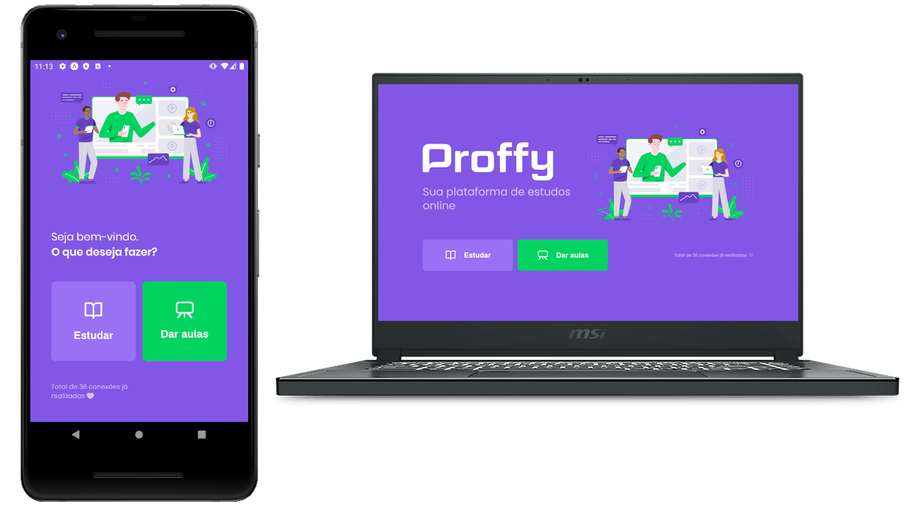

<h1 align="center">
	
</h1>

<h3 align="center">
  Proffy - find a teacher for you where you are whenever you want
</h3>


<p align="center">
  

  <a href="https://github.com/jhonpedro">
    
  </a>
  
  
  
  <a href="https://github.com/jhonpedro/Proffy/commits/master">
    
  </a>
  
  <a href="https://github.com/jhonpedro/Proffy/issues">
    
  </a>

</p>

<p align="center">
  <a href="#-about-the-project">About the project</a>&nbsp;&nbsp;&nbsp;|&nbsp;&nbsp;&nbsp;
  <a href="#-technologies">Technologies</a>&nbsp;&nbsp;&nbsp;|&nbsp;&nbsp;&nbsp;
  <a href="#-getting-started">Getting started</a>&nbsp;&nbsp;&nbsp;|&nbsp;&nbsp;&nbsp;
</p>

## 👨🏻‍💻 About the project

- <p style="color: red;">A aplication that connect students with teachers, in this project we can set up classes and study with teachers from any place in the world</strong></p>

To see the **Api project**, click here: [CRUD Users web](https://github.com/jhonpedro/Proffy/tree/master/backend)</br>
To see the **Web project**, click here: [CRUD Users web](https://github.com/jhonpedro/Proffy/tree/master/web)</br>

## 🚀 Technologies

Technologies that I used to develop this api

- [ReactJS](https://nodejs.org/en/)
- [Expo](https://expo.io/)
- [React Native](https://expressjs.com/pt-br/)
- [React router DOM](https://jwt.io/)
- [Axios](https://github.com/motdotla/dotenv)

## 💻 Getting started

See below how you can start using the project

### Requirements

- Api running
- [Node.js](https://nodejs.org/en/)
- [Yarn](https://classic.yarnpkg.com/) or [npm](https://www.npmjs.com/)
<!-- - One instance of [PostgreSQL](https://www.postgresql.org/) -->

**Clone the project and access the folder**

```bash
$ git clone https://github.com/jhonpedro/Proffy && cd Proffy
```

**Follow the steps below**

```bash
# Install the dependencies
$ cd /mobile
$ yarn install

# To finish, run the api service
$ yarn start

# Be sure that the Api is running!
```

> I'm using this template [here](https://github.com/EliasGcf/readme-template/tree/master/templates)
